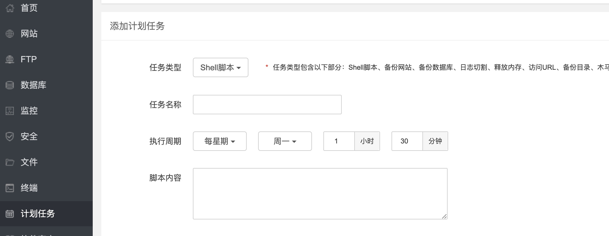

# 通知
由于学校后端登入接口变更，实力不济，本脚本暂时无法使用。

# FuckDailyCP-HUFT
该项目源自Finch大佬的FuckDailyCP。可以挂在服务器上帮助打卡。 别的我就不多说了。😅   
该项目是针对合工大机械学院的特供版本。由本脚本产生的问题（查水表等）由用户承担责任。


## 食用方法

* 安装了centos的服务器一台（是服务器就行）
* 安装宝塔面板（方便定时任务，要不就使用crontab 进行定时任务）
* python 3.6+
* 安装一些依赖
    ```bash
    pip3 install -r requirements.txt
    ```

    

* 设置定时任务 每天 20 点后执行脚本。

* 定时脚本内容
    ```bash
    cd 脚本所在目录;
    python3 DailyCP.py 合肥工业大学 学号 密码 定位地址 formdb文件夹的绝对地址
    ```
